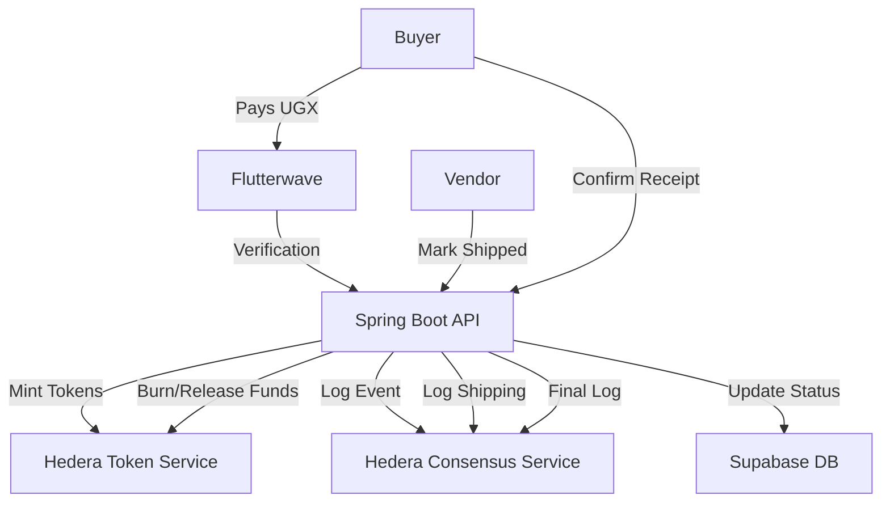

# 🛡️ Twiinex V2: Decentralized Social Commerce Escrow


**Twiinex V2** is a premium, decentralized escrow platform designed to secure social commerce in East Africa. By utilizing **Hiero Enterprise Java** and the **Hedera network**, Twiinex ensures that transactions between social media vendors and buyers are immutable, transparent, and safe from fraud.

---

## ✨ Key Features

- **🔒 Tokenized Vaults (HTS)**: Funds are converted into stable tokens and locked in a secure Hedera vault until delivery is confirmed.
- **📜 Immutable Audit Trail (HCS)**: Every transaction event (payment, shipping, receipt) is logged to the Hedera Consensus Service for a verifiable history.
- **📱 4-Step Escrow Flow**: A seamless user experience that guides buyers through Funding, Holding, Shipping, and Verification.
- **💰 Flutterwave Integration**: Integrated with Mobile Money (MTN, Airtel) and Card payments for local accessibility.
- **📊 Real-time Sync**: Live polling ensures the vendor dashboard and buyer payment pages stay in sync without manual refreshes.

---

## 🛠️ Tech Stack

### **Backend (Hiero-Enterprise-Spring)**
- **Language**: Java 21 (Spring Boot 3.4)
- **Blockchain**: Hedera Token Service (HTS) & Hedera Consensus Service (HCS)
- **Database**: Supabase (PostgreSQL + Real-time)
- **Payment Gateway**: Flutterwave

### **Frontend (Vite + React)**
- **Styling**: Vanilla CSS with Modern Aesthetics (Glassmorphism, Dark Mode)
- **State Management**: React Hooks & Context
- **Animations**: Framer Motion
- **Icons**: Lucide React

---

## 🏗️ Architecture



---

## 🚀 Getting Started

### **1. Prerequisites**
- Java 21+
- Node.js 18+
- Hedera Testnet Account (via [Hedera Portal](https://portal.hedera.com/))
- Supabase Project
- Flutterwave Test API Keys

### **2. Backend Setup**
Navigate to the server directory and configure your `application.properties`:

```bash
cd twiinex-v2-server
```

**`src/main/resources/application.properties`**:
```properties
spring.hiero.accountId=0.0.XXXX
spring.hiero.privateKey=302e0201...
spring.hiero.topicId=0.0.YYYY
spring.hiero.tokenId=0.0.ZZZZ
flw.secretKey=FLWSECK_TEST-...
```

Run the server:
```bash
./mvnw spring-boot:run
```

### **3. Frontend Setup**
Navigate to the client directory and create a `.env` file:

```bash
cd twiinex-v2-client
```

**`.env`**:
```env
VITE_API_URL=http://localhost:8080
VITE_SUPABASE_URL=your_supabase_url
VITE_SUPABASE_ANON_KEY=your_anon_key
VITE_FLW_PUBLIC_KEY=FLWPUBK_TEST-XXXX
```

Install dependencies and start:
```bash
npm install
npm run dev
```

---

## 🔒 Security

- **Operator Keys**: All blockchain interactions are signed by an enterprise operator account.
- **Escrow Logic**: Funds are only released when the buyer explicitly confirms receipt, or via a dispute resolution mechanism.
- **Auditability**: Anyone with the HCS Topic ID can verify the transaction timeline on [Hashscan](https://hashscan.io/testnet/dashboard).

---

## 📄 License
This project is licensed under the MIT License - see the LICENSE file for details.

---

Built with ❤️ by the **Twiinex Team** using **Hiero Enterprise**.
