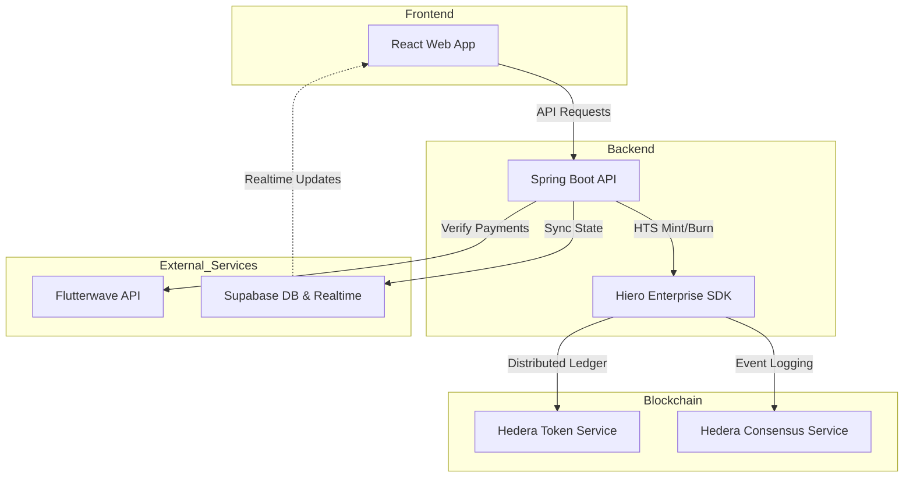

# 🛡️ Twiinex V2: Decentralized Social Commerce Escrow

<p align="center">
  
</p>

<p align="center">
  
  
  
  
</p>

---

**Twiinex V2** is a premium, decentralized escrow platform designed to secure social commerce in East Africa. By utilizing **Hiero Enterprise Java** and the **Hedera network**, Twiinex ensures that transactions between social media vendors and buyers are immutable, transparent, and safe from fraud.

## ✨ Key Features

- **🔒 Tokenized Vaults (HTS)**: Funds are converted into stable tokens and locked in a secure Hedera vault until delivery is confirmed.
- **📜 Immutable Audit Trail (HCS)**: Every transaction event (payment, shipping, receipt) is logged to the Hedera Consensus Service for a verifiable history.
- **📱 4-Step Escrow Flow**: A seamless user experience that guides buyers through Funding, Holding, Shipping, and Verification.
- **💰 Flutterwave Integration**: Integrated with Mobile Money (MTN, Airtel) and Card payments for local accessibility.
- **📊 Real-time Sync**: Live polling and Supabase Realtime ensure the vendor dashboard and buyer payment pages stay in sync.

---

## 🏗️ System Architecture

Twiinex V2 follows a distributed architecture designed for scale and security:



---

## 📂 Project Structure

This repository is a monorepo containing the following components:

| Directory | Role | Tech |
|-----------|------|------|
| [`twiinex-v2-client`](./twiinex-v2-client) | User & Vendor Interface | React, Vite, Vanilla CSS |
| [`twiinex-v2-server`](./twiinex-v2-server) | Core Business Logic | Spring Boot, Hiero Spring |
| [`hiero-enterprise-java`](./hiero-enterprise-java) | Enterprise Hedera SDK | Java 21, gRPC |

---

## 🚀 Quick Start

### 1. Prerequisites
- **Java 21+**
- **Node.js 18+**
- **Hedera Testnet Account** ([Join here](https://portal.hedera.com/))
- **Supabase Account**

### 2. Setup
1.  **Clone the Repository**:
    ```bash
    git clone https://github.com/Twiineenock/Twiinex-V2.git
    cd Twiinex-V2
    ```

2.  **Initialize SDK**:
    ```bash
    cd hiero-enterprise-java
    ./mvnw clean install -DskipTests
    cd ..
    ```

3.  **Start Backend**:
    Follow the [Backend Setup Guide](./twiinex-v2-server/README.md).

4.  **Start Frontend**:
    Follow the [Frontend Setup Guide](./twiinex-v2-client/README.md).

---

## 🛡️ Security & Compliance

- **Enterprise Custody**: Operator keys are handled via enterprise-grade configuration patterns.
- **Non-Custodial Logic**: The platform acts as an automated orchestrator, with funds locked in verifiable HTS vaults.
- **Transparency**: Every critical step is logged to HCS, allowing for third-party auditing via [Hashscan](https://hashscan.io/testnet/).

---

## 📄 License
This project is licensed under the **MIT License**. See the [LICENSE](./LICENSE) file for more details.

---

<p align="center">
  Built with ❤️ by the <b>Twiinex Team</b> using <b>Hiero Enterprise</b>.
</p>
